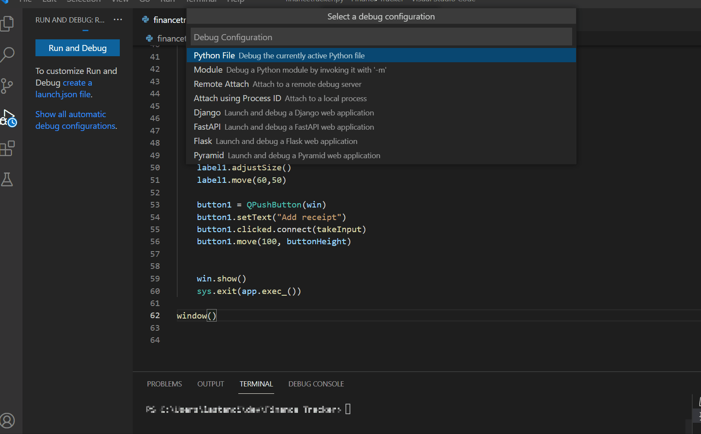

# Introduction to Python Finance Tracker App
## Main Objectives : 

- Create a basic Finance Tracker Application on Python
- Input receipt information to your newly created application, by code 
- Learn how to input data directly from the terminal
- *Optional* - Create a simple UI (user interface)
<br>

## Purpose of the project: 
&diams; Exercise and improve your Python knowledge<br>
&diams; Automate receipt tracking and get information about your spendings

## Prerequisites
- Python 3 installed to your device 
    - You can check this by opening
    `Command Prompt > Type Python Or py > Hit Enter`<br>
    - If Python is installed it will show the version details, otherwise you need to install it. Find more information on that here.
- [Visual Studio Code](https://code.visualstudio.com/), [Python Idle Shell](https://docs.python.org/3/library/idle.html) or any other code editor that you have installed in your device.
-  <p>Optional - some coffee or tea &#9749;</p>
<br>

# Setup the project

If you have Python and SQLite DB installed already, you can skip this steps, if not, follow along.

### Install Python on Windows:<br>
   -   Go to [www.python.org](https://www.python.org)
    and the click the Downloads tab. Click on the Python 3 button. After the download is finished, look for the path where the file got saved aaand double-click. <br>
    - Simply go through the standard installation process using the wizard.<br>
    - You can check again your python version at your command promp, using py, Python 3 should be appear now.<br>
    * If you have a different operating system and you encounter blokers, please search for the installation steps specific for your OS. 

### Install SQLite database: <br>

 - Download SQLite from [www.sqlite.org](https://sqlite.org/index.html). Double click the sqlite file to open it. The software will then open in the command line and you can execute any sql commands.
- You can also manage your SQLite databases using [DB browser for SQLite](https://sqlitebrowser.org/)

# Get started

Create a folder where you will save the .py file and also where the data base will be created.
 
Create a new file `financetracker.py`

1. Import the python modules and functions your app is going to use 


```py
from os import supports_bytes_environ
import sqlite3
from datetime import datetime
```
2. Next you will create your database as it follows : 
- First you start by creating a connection object that represents the database:

```
conn = sqlite3.connect("spent.db")
```
I called my database 'spent' so my data will be stored in the file called `spent.db`. 

- Next we create a cursor using the `connection.cursor()` method. The cursor is an object that creates the connection for executing queries and access records from our SQLiteb DB.

```
curs = conn.cursor() 
```
- Next you have the `Create table` statement which creates a new table, if it doesn't already exist. The syntax here contains the name of the table as well as the schema.  
```py
sql = '''                           
create table if not exists expenses (
    amount number,
    category string,
    message string,
    date string
    )
'''
```


And now 

```
curs.execute(sql)
conn.commit() 
```
These two lines of code execute the sql variable and commits the changes made in the previous lines, to the database. 

- Now that the database will be created with the three main categories (amount, category, message), this step focuses on how to add data to your database.
- Create a new variable to store the date&time using the `datetime` module.
- Create another variable for user input and for this you can use pythons built-in `input` function, which will handle input from the user and output it at the terminal.
- The next lines ensure that the user input and date inofrmation are added to your database. Then executes the sql and date variables and commits the changes made in the previous lines

```py
date = str(datetime.now())         
data = ((input ("Please provide amount:\n")),(input("Please provide category:\n")), (input("Please provide message:\n")), date) 
sql = 'INSERT INTO expenses VALUES (?, ?, ?, ?)'
curs.execute(sql, data)              
conn.commit()
```
<br>
</br>

# Let's test 


<br></br>
# Create a simple UI (Part 1)

I was happy to input my receipts using the terminal, but having a few buttons here and there somehow makes me feel like a responsible adult, don't you think?

Well, whatever your reason is, you are welcome to explore the UI section, which as I was saying it's very simple and in this case it's done using PyQt5. 

You can of course go ahead and create a web application or create your own user interface, but if you are curious about the way I done it keep reading...(or click here for shortcut to code)

In Part 1 the UI and finance tracker code will be in one file. It is not a recommended practice so this is mainly for the demostration purposes for this project. However in Part 2 I will post a different way that involves separating the projects code from the UI. 

PyQt is a Python binding of the cross-platform GUI toolkit Qt, implemented as a Python plug-in. Here are some for more details: 
- [pypi.org](https://pypi.org/project/PyQt5/)
- [www.riverbankcomputing.com/static/Docs/PyQt5](https://www.riverbankcomputing.com/static/Docs/PyQt5/)
- Installation : `pip install PyQt5`

### UI code ###

``` python
from os import supports_bytes_environ
import sqlite3
from datetime import datetime
from PyQt5.QtWidgets import QApplication, QMainWindow, QPushButton, QLabel, QInputDialog
import sys
from PyQt5.sip import setdestroyonexit

conn = sqlite3.connect("spent.db")
cur = conn.cursor()                  
sql = '''                           
create table if not exists expenses (
    amount number,
    category string,
    message string,
    date string
    )
'''
cur.execute(sql)                    
conn.commit()   

def window():

    buttonHeight = 170
    label1Text = "Track your your expenditures here:"


    def takeInput():
        value, ok = QInputDialog.getDouble(win, "Add amount:", "Amount")

        category, ok = QInputDialog.getText(win, "Add category:", "Category")

        message, ok = QInputDialog.getText(win, "Add message:", "Message")
  
        if value and category and message and ok:
            date = str(datetime.now())         
            data = (value, category, message, date) 
            sql = 'INSERT INTO expenses VALUES (?, ?, ?, ?)'
            cur.execute(sql,data)                    
            conn.commit()


    app = QApplication(sys.argv)
    win = QMainWindow()
    win.setGeometry(500,200,800,500)
    win.setWindowTitle("Finance Tracker")
 
    label1 = QLabel(win)
    label1.setText(label1Text)
    label1.adjustSize()
    label1.move(60,50)

    button1 = QPushButton(win)
    button1.setText("Add receipt")
    button1.clicked.connect(takeInput)
    button1.move(100, buttonHeight)
    

    win.show()
    sys.exit(app.exec_())
     
window()

```
# Last test #




 
